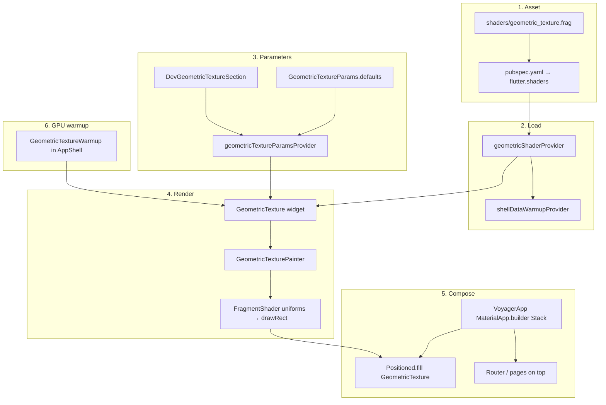

# Background Pipeline

Voyager renders a single full-screen GPU shader behind all UI. The effect is an equilateral-triangle grid tinted with the user's accent color, concentrated near a configurable focal point and fading toward the edges.

## Overview



## 1. Shader asset

`shaders/geometric_texture.frag` is registered in `pubspec.yaml` under `flutter: shaders:`. Flutter compiles it to a `FragmentProgram` at build time.

The shader draws:

- An **equilateral triangle grid** using oblique (triangular lattice) coordinates so each ▲/▽ triangle gets one flat color with no seams.
- A **deterministic per-triangle hash** → shade in `[u_variation_floor, 1.0]`.
- A **radial accent gradient** from `u_focal_point`, aspect-corrected for wide screens.
- Final color: `mix(base, accent, ambient + burst)` where ambient is a faint shimmer (`variation × 0.08`) and burst is the focal tint (`gradient × variation × intensity`).

Default focal point is **right-center** `(1.0, 0.5)` — accent glows from the right edge toward the content area.

## 2. Loading

`geometricShaderProvider` in `lib/app/providers.dart`:

- Loads via `FragmentProgram.fromAsset('shaders/geometric_texture.frag')`.
- Uses `keepAlive()` so the program is loaded once per session.
- On failure: reports a `FlutterError` and returns `null` (graceful degradation, no crash).

Also awaited in `shellDataWarmupProvider` alongside journals, settings, calendar data, etc., so the shader is ready during startup prefetch.

## 3. Tunable parameters

`GeometricTextureParams` in `lib/core/widgets/geometric_texture.dart` mirrors the shader uniforms:

| Parameter | Default | Effect |
|-----------|---------|--------|
| `scale` | 10.0 | Triangle density |
| `intensity` | 0.85 | Peak accent at focal point |
| `focalSpread` | 1.0 | Gradient radius |
| `focalPointX` / `focalPointY` | 1.0 / 0.5 | Focal position in normalized UV |
| `variationFloor` | 0.75 | Minimum triangle brightness |

Production uses defaults via `geometricTextureParamsProvider`. The Dev page exposes live sliders and focal presets in `DevGeometricTextureSection` (`lib/features/dev/dev_geometric_texture_tile.dart`).

## 4. Widget → painter → GPU

`GeometricTexture` (`lib/core/widgets/geometric_texture.dart`):

1. Creates a `FragmentShader` from the program (disposed on change/unmount).
2. If `program == null` → `ColoredBox(baseColor)` — no spinner, no error UI.
3. Otherwise → `CustomPaint` with `GeometricTexturePainter`.

The painter pushes 16 floats into the shader (order must match the GLSL uniforms), then `canvas.drawRect` for the full bounds:

```
// Uniform layout (must match shader declaration order):
// 0-1   vec2  u_resolution
// 2     float u_scale
// 3     float u_intensity
// 4     float u_focal_spread
// 5-6   vec2  u_focal_point
// 7     float u_variation_floor
// 8-11  vec4  u_base_color
// 12-15 vec4  u_accent_color
```

`shouldRepaint` triggers on shader, colors, or params changes.

## 5. App-level composition

The background lives in `VoyagerApp`'s `MaterialApp.router` **builder**, not in individual pages (`lib/app/voyager_app.dart`):

- **Bottom layer:** `Positioned.fill` → `GeometricTexture`
- **Top layer:** `DefaultTextStyle` + router child (all UI)

Colors:

- **Base:** `theme.scaffoldBackgroundColor` = `#1B1B22` (`VoyagerTheme`)
- **Accent:** user setting from `settingsProvider`

`AppShell` uses `Scaffold(backgroundColor: Colors.transparent)` so the texture shows through the main chrome. Opaque surfaces (cards `#2A2A33`, app bars `#24242B`, inputs, dialogs) sit above it.

## 6. UI that interacts with the background

Most pages do not reference the shader directly — they are transparent or opaque by convention.

**Journal** is explicit: `_JournalBarBackdrop` in `lib/features/journal/journal_page.dart` blurs and tints the texture for top/bottom toolbars. It uses `scaffoldBackgroundColor` at 80% alpha with a `BackdropFilter` blur so the bars visually match the base tone while softening the triangles underneath.

## 7. GPU warmup (avoid first-frame jank)

Two mechanisms:

**A. Data warmup** — `shellDataWarmupProvider` awaits `geometricShaderProvider.future` during startup.

**B. Paint warmup** — `GeometricTextureWarmup` in `AppShell` (`lib/features/journal/geometric_texture_warmup.dart`) after login:

- Waits for the compiled program.
- Paints a nearly invisible (`opacity: 1/255`) 800×600 `GeometricTexture` for **3 frames**.
- Forces GPU shader compilation before the user hits content-heavy views.
- Then removes itself (`SizedBox.shrink()`).

## 8. Failure modes

| Condition | Behavior |
|-----------|----------|
| Shader load fails | `null` program → flat `#1B1B22` fill |
| Shader still loading | Same flat fill (no loading state) |
| Accent changes | `VoyagerApp` rebuilds → painter repaints |
| Dev slider changes | `geometricTextureParamsProvider` → live repaint |

## File map

| File | Role |
|------|------|
| `shaders/geometric_texture.frag` | GLSL triangle grid + gradient |
| `lib/core/widgets/geometric_texture.dart` | Params, widget, painter |
| `lib/app/providers.dart` | Shader + params providers |
| `lib/app/voyager_app.dart` | Full-screen background stack |
| `lib/features/shell/app_shell.dart` | Transparent scaffold + GPU warmup |
| `lib/features/journal/geometric_texture_warmup.dart` | Hidden 3-frame compile warmup |
| `lib/features/dev/dev_geometric_texture_tile.dart` | Live tuning UI |
| `test/tool/geometric_shader_smoke_test.dart` | Shader load + uniform smoke test |
| `test/tool/geometric_texture_widget_test.dart` | Widget paint smoke test |
